# Indoor

### Detection in Indoor Scenes

Provided task is split into 3 stages:
* **Analyse**: Data Visualization and Explanation
* **Make Splits**: Preprocessing data for training
* **Training**: Model training and validation

First two stages are provided in <em>notebooks</em> folder  
Code for the last part is stored in <em>indoor</em> folder

### List of functionality
**Implemented** 
<input type="checkbox" name="vehicle1" checked=1 disabled=1> Model Training 
<input type="checkbox" name="vehicle1" checked=1 disabled=1> Predicts visualization 
<input type="checkbox" name="vehicle1" checked=1 disabled=1> mAP and mAR metrics  
<input type="checkbox" name="vehicle1" checked=1 disabled=1> per class mAP metrics   
**Not Implemented but could be useful** 
<input type="checkbox" name="vehicle1" disabled=1> Share info between nearby frames  
<input type="checkbox" name="vehicle1" disabled=1> Sequence business metric*  
<input type="checkbox" name="vehicle1" disabled=1> Modulated deformable convs**  
<input type="checkbox" name="vehicle1" disabled=1> box_score thrs for each class  
<input type="checkbox" name="vehicle1" disabled=1> ablation study for params, archs etc.

*Metric that shows model quality on each sequence of frames
**Should work fine for this task

### Stack & Arch & Params

* **DL lib**: Pytorch x Torchvision
* **MlOps & Tracking**: ClearML
* **Detector**: Faster-RCNN based 2 stage detector
* **Backbone**: ResNeST 50 (ResNet 50 with split Attention)

* **Batch size**: 4
* **Epochs**: 50
* **Base Lr**: 0.0005
* **Pretrain**: None
* **Optimizer**: Ranger (Lookahead + RAdam)
* **Lr_scheduler**: ReduceOnPlateo with reloading best checkpoint*

*That's my favourite, always SOTA

### Results
#### Best mAP@50: 97.2
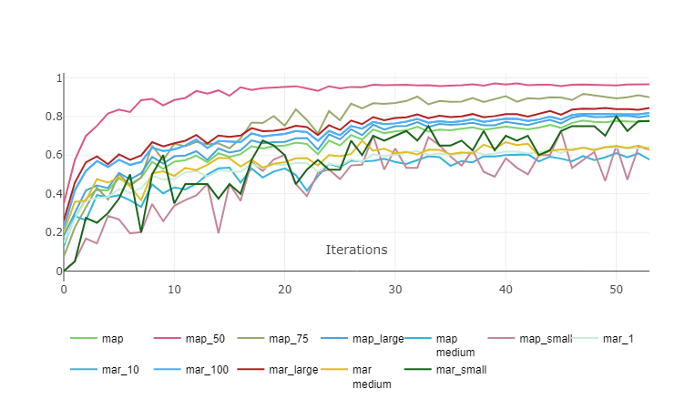

#### mAP per class
<table>
<tr>
    <td>
        <b>Class</b>
    </td>
    <td>
        <b>mAP</b>
    </td>
</tr>
<tr>
    <td>
        fireextinguisher
    </td>
    <td>
        0.75
    </td>
</tr>
<tr>
    <td>
        chair
    </td>
    <td>
        0.79
    </td>
</tr>
<tr>
    <td>
        exit
    </td>
    <td>
        0.79
    </td>
</tr>
<tr>
    <td>
        clock
    </td>
    <td>
        0.76
    </td>
</tr>
<tr>
    <td>
        trashbin
    </td>
    <td>
        0.61
    </td>
</tr>
<tr>
    <td>
        screen
    </td>
    <td>
        0.69
    </td>
</tr>
<tr>
    <td>
        printer
    </td>
    <td>
        0.79
    </td>
</tr>
</table>
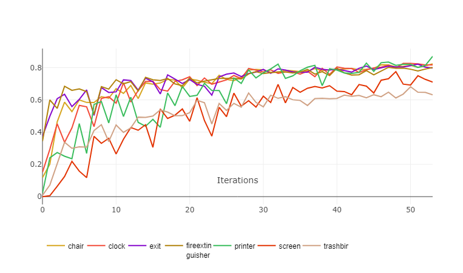

### Good examples
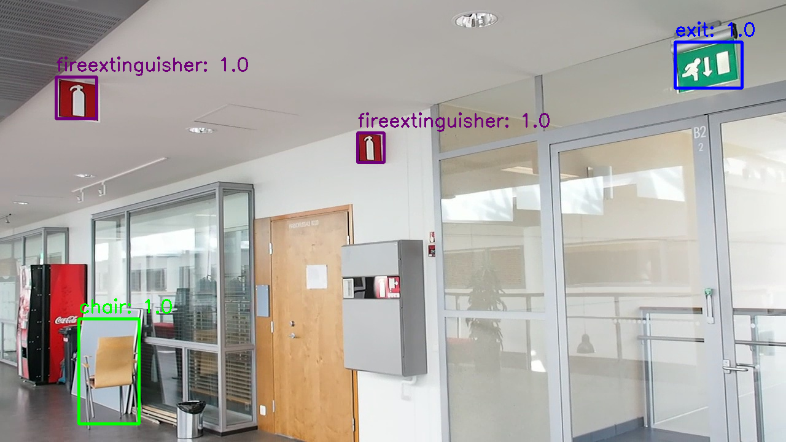
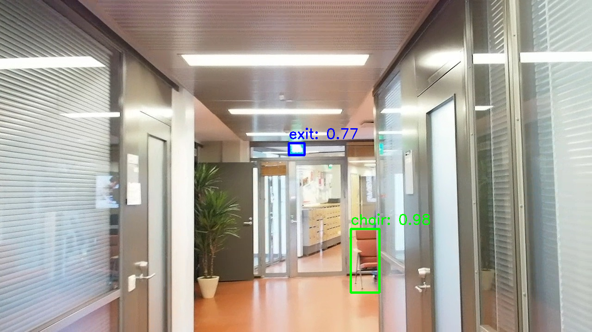
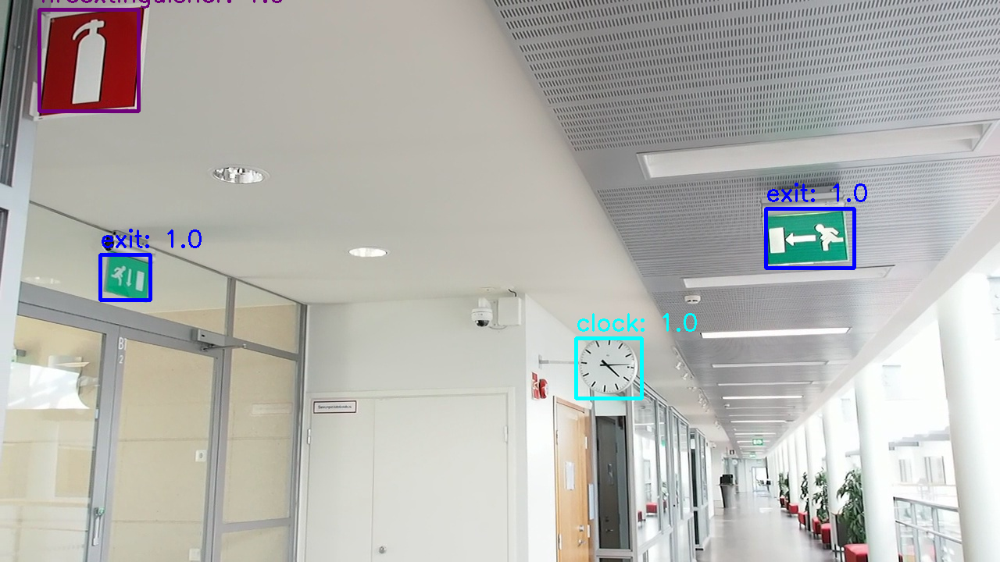
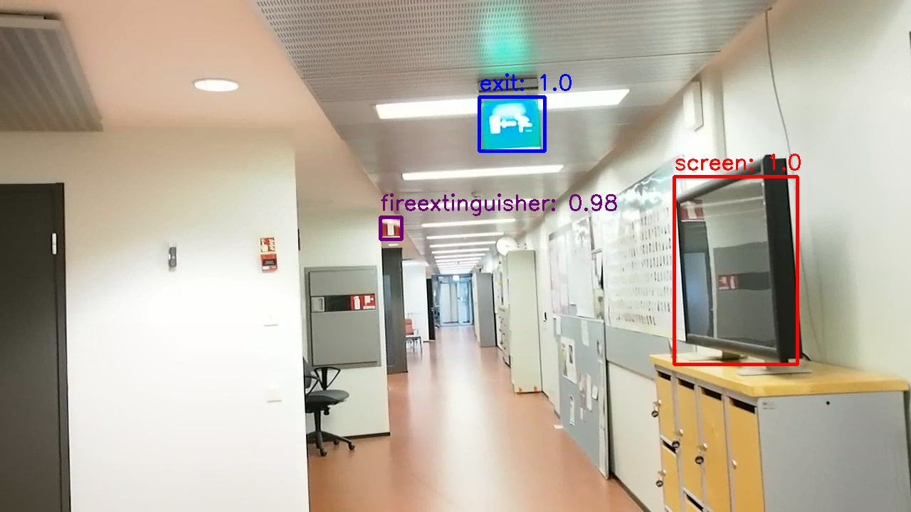
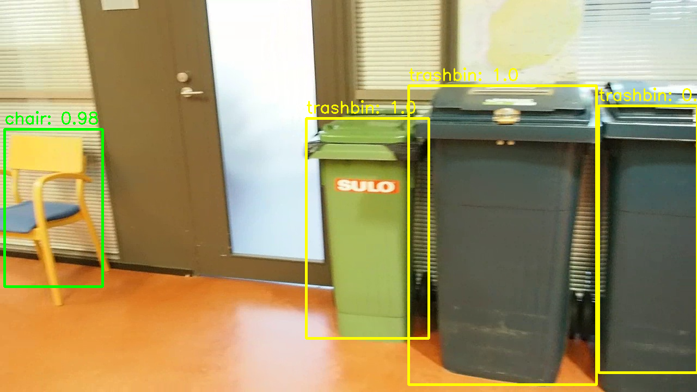
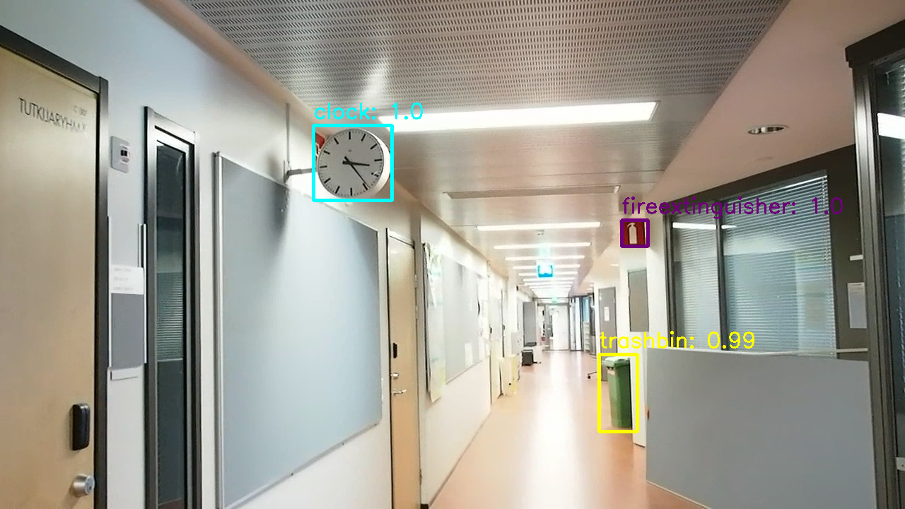

### Bad examples
FP for different classes

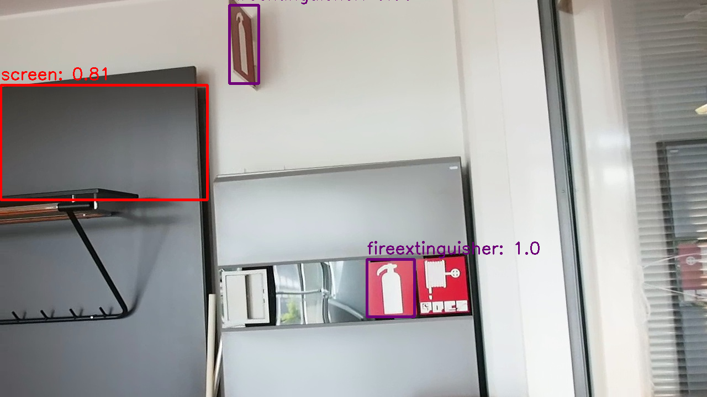
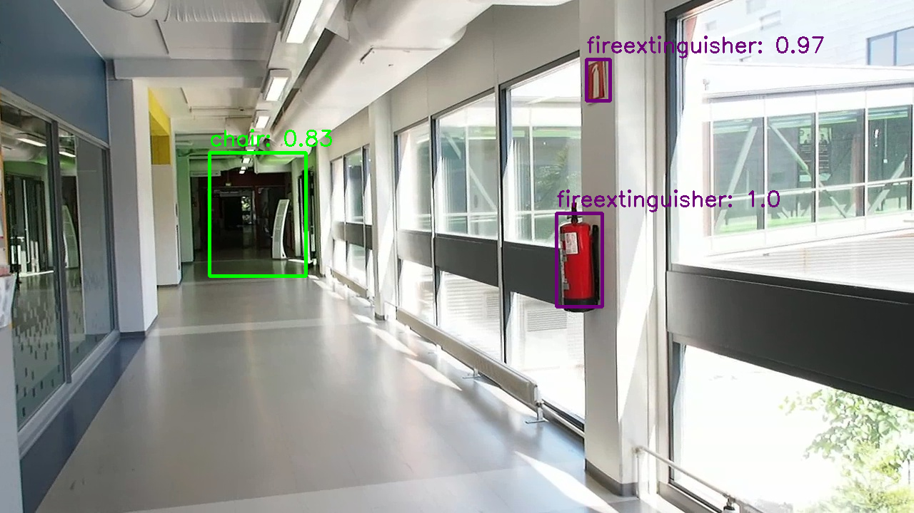
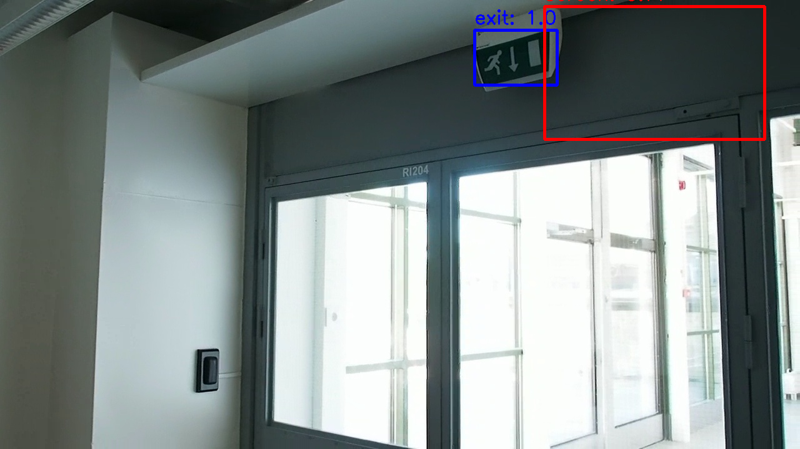

### Next frame example

At evaluation should aggregate predictions from nearby frames because of cases like this

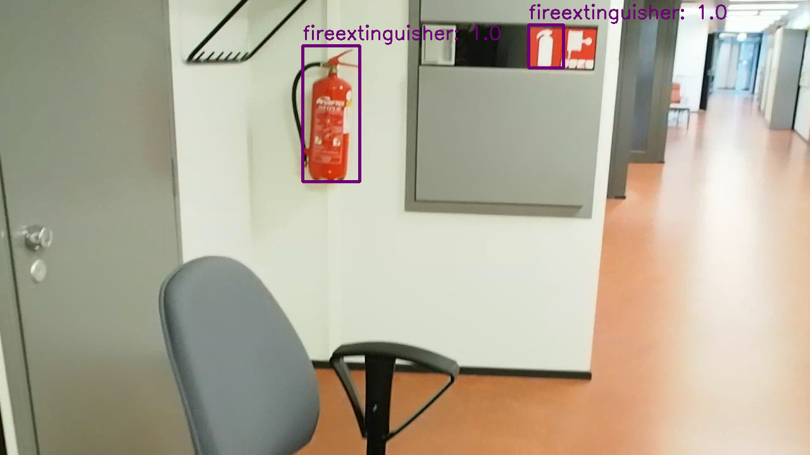
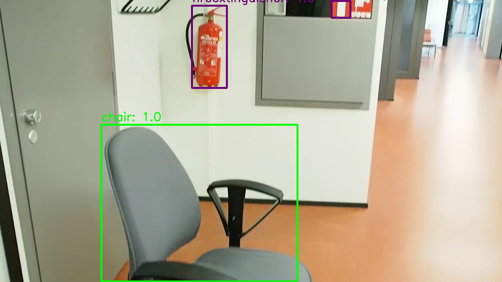

### Summary 

* Got pretty good working model but there are many ways to increase final quality
* Statements mentioned in "Not Implemented but could be useful" are crucial but not included in this work